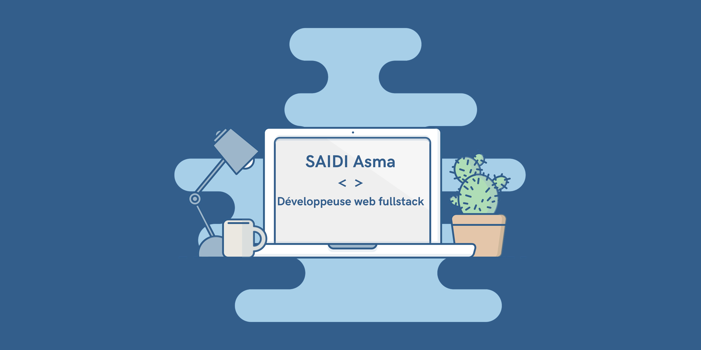

  

# 👋 Hi there, I'm Asma

**🚀 Full-Stack Web Developer | Passionate about building scalable and efficient applications**

🌍 Based in **Strasbourg**  
✉️ Reach me at [saidiasma422@gmail.com](mailto:saidiasma422@gmail.com)  
   Learn  at the moment

💼 Open to **freelance & collaboration opportunities**  

---

## 🚀 Tech Stack

### 💻 Languages & Frameworks

  

### 🛠 Tools & Databases

  

---

## 🌐 Connect with me

  
  

---

# 📊 GitHub Stats

  
   
  
   
  

